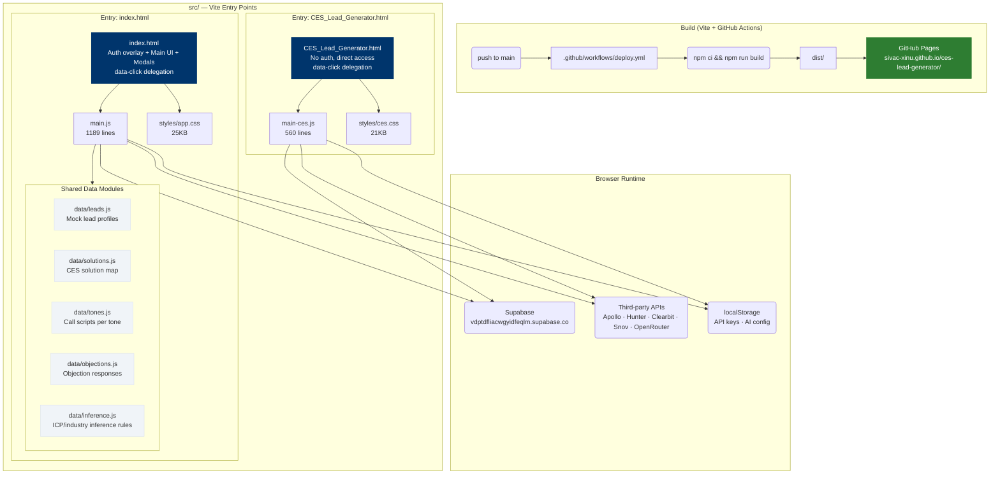

# Architecture

```mermaid
flowchart TB
  subgraph Build["Build (Vite + GitHub Actions)"]
    GH("push to main") --> GHA[".github/workflows/deploy.yml"]
    GHA --> CI("npm ci && npm run build")
    CI --> DIST["dist/"]
    DIST --> PAGES["GitHub Pages<br/>sivac-xinu.github.io/ces-lead-generator/"]
  end

  subgraph Source["src/ — Vite Entry Points"]
    direction LR

    subgraph Index["Entry: index.html"]
      IHTML["index.html<br/>Auth overlay + Main UI + Modals<br/>data-click delegation"]
      IHTML --> IJS["main.js<br/>1189 lines"]
      IHTML --> ICSS["styles/app.css<br/>25KB"]
      IJS --> DATA
    end

    subgraph CES["Entry: CES_Lead_Generator.html"]
      CHTML["CES_Lead_Generator.html<br/>No auth, direct access<br/>data-click delegation"]
      CHTML --> CJS["main-ces.js<br/>560 lines"]
      CHTML --> CCSS["styles/ces.css<br/>21KB"]
    end

    subgraph DATA["Shared Data Modules"]
      LEADS["data/leads.js<br/>Mock lead profiles"]
      SOL["data/solutions.js<br/>CES solution map"]
      TONES["data/tones.js<br/>Call scripts per tone"]
      OBJ["data/objections.js<br/>Objection responses"]
      INF["data/inference.js<br/>ICP/industry inference rules"]
    end
  end

  subgraph Runtime["Browser Runtime"]
    SUPABASE("Supabase<br/>vdptdfliacwgyidfeqlm.supabase.co")
    APIS("Third-party APIs<br/>Apollo · Hunter · Clearbit · Snov · OpenRouter")
    LOCAL("localStorage<br/>API keys · AI config")
  end

  IJS --> SUPABASE
  IJS --> APIS
  IJS --> LOCAL
  CJS --> SUPABASE
  CJS --> APIS
  CJS --> LOCAL

  classDef entry fill:#00356C,color:#fff,stroke:#00356C,stroke-width:2px
  classDef module fill:#f0f4f8,stroke:#dde3f0
  classDef deploy fill:#2e7d32,color:#fff,stroke:#2e7d32
  class IHTML,CHTML entry
  class LEADS,SOL,TONES,OBJ,INF module
  class PAGES deploy
```
